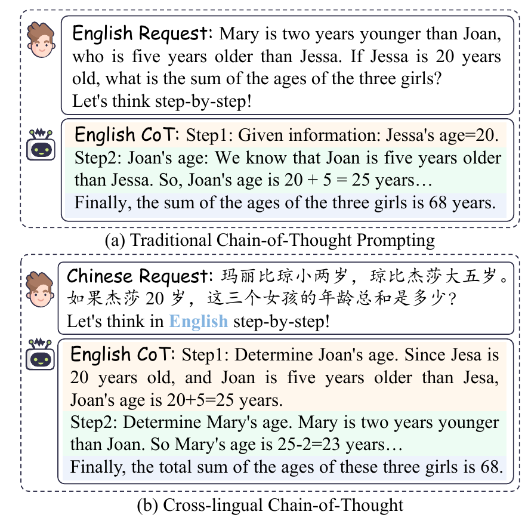
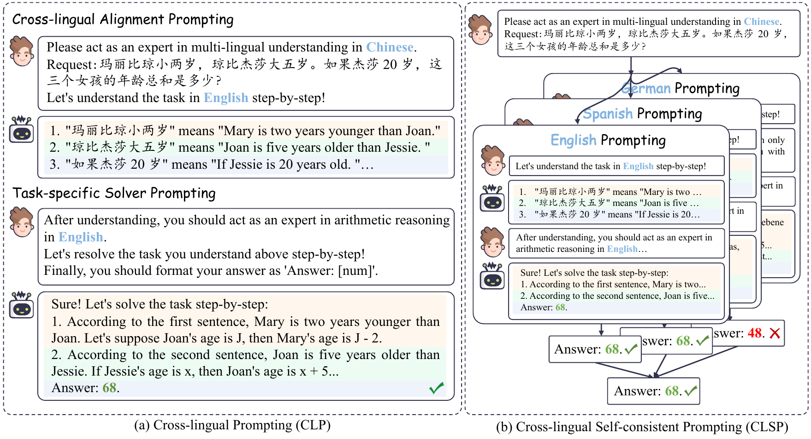
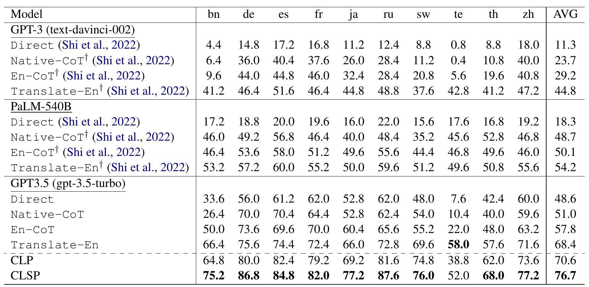

# Cross-lingual Prompting: Improving Zero-shot Chain-of-Thought Reasoning across Languages

<div align="center">
<a href="https://github.com/LightChen233/cross-lingual-prompting/pulls">
<image src="https://img.shields.io/badge/PRs-welcome-brightgreen">
</a>
<a>
    
</a>
<a href="https://github.com/LightChen233/cross-lingual-prompting/network/members">
    
</a>
<a href="https://github.com/LightChen233/cross-lingual-prompting/issues">
    
</a>
</div>
<div>


</div>
This repository contains the implementation and the data of the paper: Cross-lingual Prompting: Improving Zero-shot Chain-of-Thought Reasoning across Languages. Libo Qin*, Qiguang Chen*, Fuxuan Wei, Shijue Huang, Wanxiang Che. EMNLP 2023. [<a href="https://aclanthology.org/2023.emnlp-main.163">PDF</a>] .

<div align="center">

</div>

##  Reference

If you find this project useful for your research, please consider citing the following paper:

```
@inproceedings{qin-etal-2023-cross,
    title = "Cross-lingual Prompting: Improving Zero-shot Chain-of-Thought Reasoning across Languages",
    author = "Qin, Libo  and
      Chen, Qiguang  and
      Wei, Fuxuan  and
      Huang, Shijue  and
      Che, Wanxiang",
    editor = "Bouamor, Houda  and
      Pino, Juan  and
      Bali, Kalika",
    booktitle = "Proceedings of the 2023 Conference on Empirical Methods in Natural Language Processing",
    month = dec,
    year = "2023",
    address = "Singapore",
    publisher = "Association for Computational Linguistics",
    url = "https://aclanthology.org/2023.emnlp-main.163",
    doi = "10.18653/v1/2023.emnlp-main.163",
    pages = "2695--2709",
}
```

##  Framework


##  Quick Start

### Install from git
```shell
git clone https://github.com/LightChen233/cross-lingual-prompting.git && cd cross-lingual-prompting/
pip install -r requirements.txt
```

### Reproduction
```shell
python metric.py --dataset-name mgsm \
                 --exp-name CLSP
```
**Parameters:**
- `dataset-name`: dataset name.
- `exp-name`: experiment names, which are selected from `['CLP', 'CLSP']`, .

##   Re-request for further exploration
### 1. Request from ChatGPT
```shell
python request.py --api-key sk-xxx \
                  --input-dir mgsm/input \
                  --output-dir mgsm/output \
                  --parallel-num 10
```
**Parameters:**
- `api-key`: OpenAI API-KEY
- `input-dir`: original data dir path
- `output-dir`: generated data dir path to save
- `parallel-num`: the parallel thread number of request

### 2. Merge Output Files
```shell
python merge.py --input-dir mgsm/output \
                  --output-dir mgsm/output \
                  --parallel-num 10
```
**Parameters:**
- `input-dir`: generated data dir path to merge, which equals to `output-dir` in step 1.
- `output-dir`: generated data dir path to save.
- `parallel-num`: the parallel thread number of request, which equals to `parallel-num` in step 1.
### 3. Metric Outputs
```shell
python metric.py --input-dir mgsm/output \
                  --metric-mode common
```
**Parameters:**
- `input-dir`: generated data dir path to save, which equals to `output-dir` in step 2.
- `metric-mode`: selected from `['common', 'clsp']`, `common` denotes the regular CoT metrics and `clsp` denotes the vote mechanism for CLSP.
**Parameters:**
- `api-key`: OpenAI API-KEY
- `input-dir`: original data dir path
- `output-dir`: generated data dir path to save
- `parallel-num`: the parallel thread number of request

##  Model Performance



##  Contact

Please create Github issues here or email [Qiguang Chen](mailto:charleschen2333@gmail.com) or [Libo Qin](mailto:lbqin@csu.edu.cn) if you have any questions or suggestions.